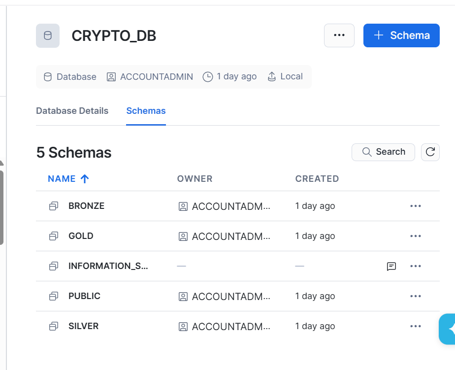
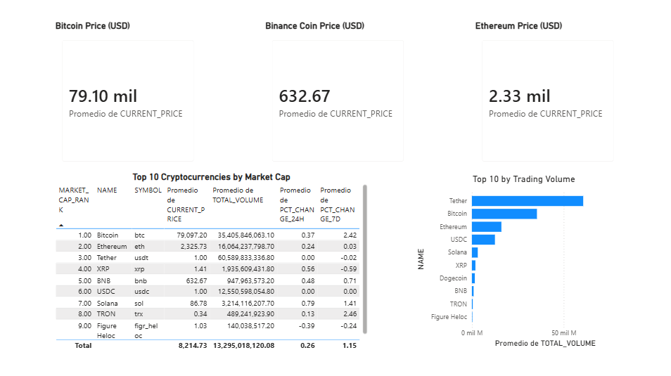
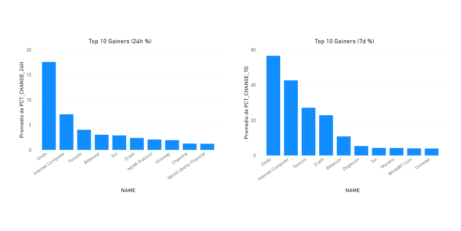
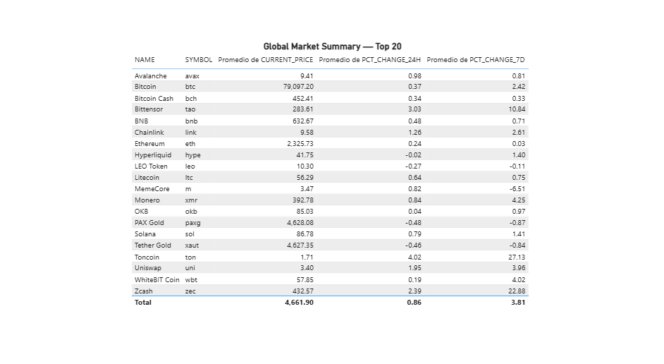
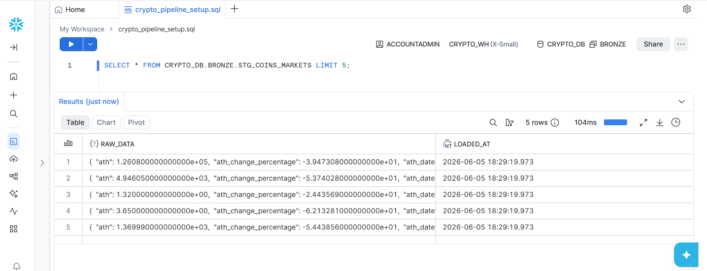
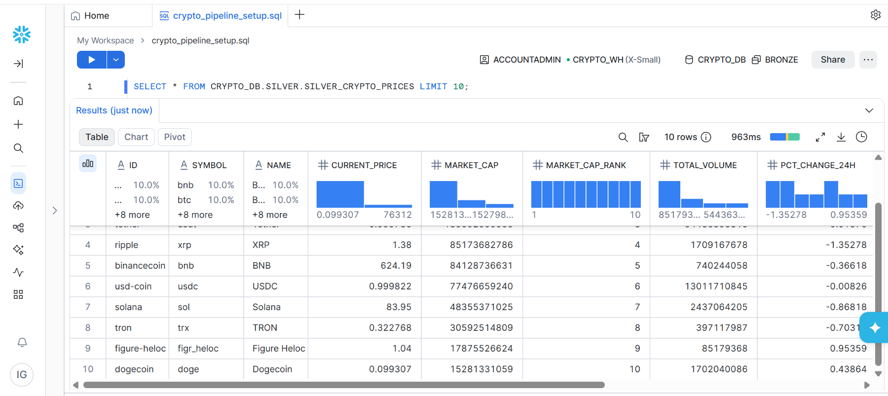
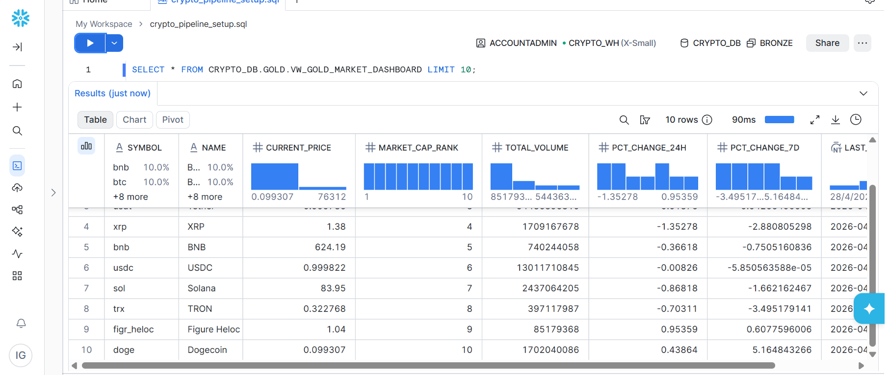

# Crypto Market Trends Pipeline

> ELT pipeline for analyzing cryptocurrency market trends using CoinGecko API, Python, Docker, AWS S3, Snowflake, and Power BI.

## Business Question
How are the price, volume, and market dominance of the top 50 cryptocurrencies changing in the short term (24h and 7 days)?

## Architecture



### Data Flow
CoinGecko API → Python → Docker → AWS S3 (Bronze) → Snowflake (Staging → Silver → Gold) → Power BI
## Tech Stack

| Layer | Tool |
|---|---|
| Extraction | Python, Requests, Pandas |
| Containerization | Docker |
| Raw Storage | AWS S3 |
| Data Warehouse | Snowflake |
| Transformation | SQL (Snowflake) |
| Visualization | Power BI |

## Medallion Architecture

| Layer | Location | Description |
|---|---|---|
| Bronze | AWS S3 + Snowflake Staging | Raw data as-is from API |
| Silver | Snowflake | Cleaned, typed, renamed columns |
| Gold | Snowflake Views | Aggregated, business-ready data |

## Dashboard

### Market Overview


### Top Movers


### Global Summary


## Snowflake Data Model

### Bronze


### Silver


### Gold


## Project Structure
crypto-market-trends-pipeline/
├── src/
│   ├── extraction/
│   │   └── extractor.py
│   ├── transformation/
│   │   └── transformer.py
│   └── load/
│       └── loader.py
├── sql/
│   ├── 01_setup.sql
│   ├── 02_bronze.sql
│   ├── 03_silver.sql
│   ├── 04_gold.sql
│   ├── 05_stage.sql
│   └── 06_load.sql
├── assets/
│   ├── snowflake/
│   └── powerbi/
├── powerbi/
│   └── crypto_market_dashboard.pbix
├── .env.example
├── requirements.txt
├── Dockerfile
└── main.py
## How to Run

### Prerequisites
- Python 3.13+
- Docker
- AWS account with S3 bucket
- Snowflake account

### Setup

1. Clone the repo:
```bash
git clone https://github.com/tu-usuario/crypto-market-trends-pipeline.git
cd crypto-market-trends-pipeline
```

2. Create and activate virtual environment:
```bash
python -m venv venv
venv\Scripts\activate  # Windows
source venv/bin/activate  # Mac/Linux
```

3. Install dependencies:
```bash
pip install -r requirements.txt
```

4. Configure environment variables:
```bash
cp .env.example .env
# Fill in your credentials in .env
```

5. Run the pipeline:
```bash
python main.py
```

### Run with Docker
```bash
docker build -t crypto-market-pipeline .
docker run --env-file .env crypto-market-pipeline
```

## Security
- Credentials managed via environment variables
- `.env` excluded from version control
- AWS IAM user with minimum required permissions (S3 only)
- No hardcoded secrets in code

## Future Improvements
- Orchestration with Apache Airflow
- Transformations with dbt
- Incremental loads instead of full refresh
- Unit tests with pytest
